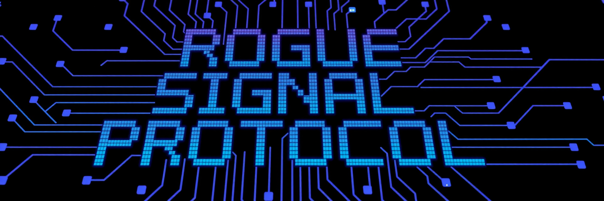
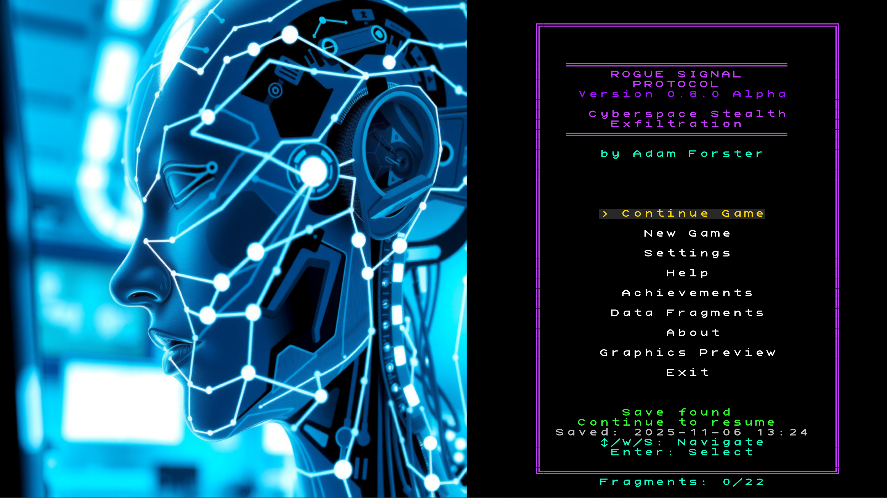
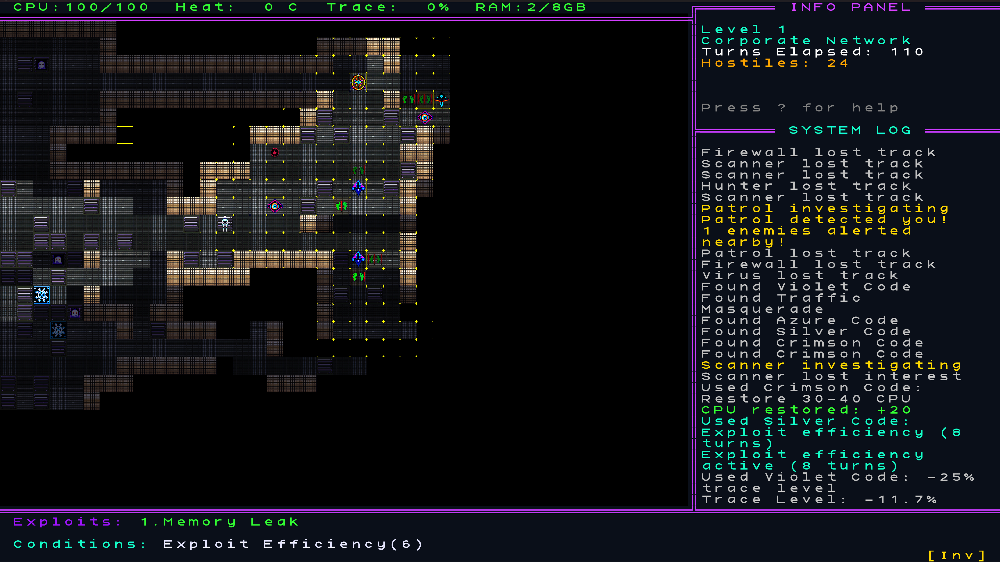
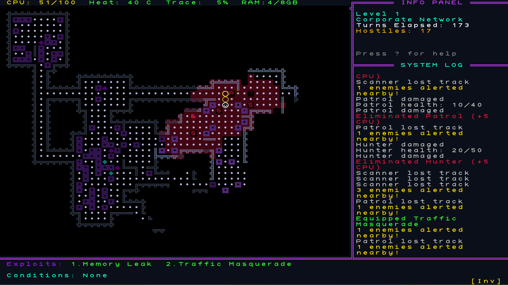
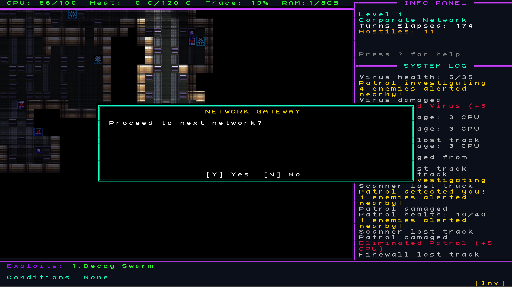

# Rogue Signal Protocol

**Version 0.8.0 Alpha** - A coffee break cyberspace stealth roguelike built with Python and TCOD


---

## 📖 Documentation

**Choose your path:**

### 🎮 For Players
**[README.txt](README.txt)** - Game instructions, controls, and gameplay guide

### 🔧 For Developers, Modders & Contributors
**[README_DEV.md](README_DEV.md)** - Complete developer guide including:
- Building from source
- Testing and development workflow
- Modding and JSON configuration
- Code architecture and TCOD gotchas
- Contributing guidelines
- Asset creation

---

## 🎮 Quick Overview

Rogue Signal Protocol is a coffee break stealth-focused cyberspace roguelike where you exfiltrate from corporate networks as a digital ghost. Complete runs in 10-15 minutes as you navigate procedurally generated levels, avoid sophisticated AI security systems, and discover the dark secrets hidden in the corporate data vaults.

### Key Features
- **🕵️ Stealth-Focused Gameplay**: Hide in blind spots, manage detection risk, avoid the Admin Avatar boss
- **🎯 Enemy Movement Prediction**: See enemies' next 3 planned moves for tactical advantage
- **🤖 8 Unique Enemy Types**: Scanners, Hunters, Viruses, Firewalls, and more
- **⚡ 12 Powerful Exploits**: Combat, stealth, and utility abilities with heat management
- **🌐 3 Network Environments**: Corporate, Government, Military with escalating difficulty
- **📚 Rich Narrative**: Discover 20+ story fragments revealing Project Chimera
- **🏆 Achievement System**: Track progress across runs with persistent unlocks
- **🔍 Interactive Look Mode**: Inspect enemies, items, and terrain with mouse or keyboard
- **🎨 Dual Rendering**: Full graphical sprites or classic ASCII/Unicode mode
- **🎵 Full Audio**: Sound effects and atmospheric music (toggleable)
- **💾 True Permadeath**: Saves deleted on death, auto-save after every action

---

## 📸 Screenshots

<p align="center">
  
  
</p>
<p align="center">
  
  
</p>

---

## 💬 Community & Links

**Join the community and stay connected:**

[](https://discord.gg/aUZgmrpU)
[](https://dragynrain.itch.io/rogue-signal-protocol)
[](https://github.com/Dragynrain/RogueSignalProtocol/)

- **💬 Discord:** [https://discord.gg/aUZgmrpU](https://discord.gg/aUZgmrpU) - Share feedback, stories, and ideas
- **🎮 Itch.io:** [https://dragynrain.itch.io/rogue-signal-protocol](https://dragynrain.itch.io/rogue-signal-protocol) - Download and follow development
- **🔧 GitHub:** [https://github.com/Dragynrain/RogueSignalProtocol/](https://github.com/Dragynrain/RogueSignalProtocol/) - Source code and issues

Share your:
- 🎮 Epic runs and close calls
- 💡 Ideas for features or improvements
- 🐛 Bug reports
- 🎨 Fan art and mods

---

## 🚀 Quick Start

### For Players (Pre-built Executable)
Download the latest release:
- **[Itch.io](https://dragynrain.itch.io/rogue-signal-protocol)** (recommended)
- **[GitHub Releases](https://github.com/Dragynrain/RogueSignalProtocol/releases)** (alternative)

### For Developers (From Source)

1. **Clone the repository**
   ```bash
   git clone https://github.com/Dragynrain/RogueSignalProtocol.git
   cd RogueSignalProtocol
   ```

2. **Set up virtual environment**
   ```bash
   python -m venv .venv
   .venv\Scripts\activate
   ```

3. **Install dependencies**
   ```bash
   pip install -r requirements.txt
   ```

4. **Run the game**
   ```bash
   python RogueSignalProtocol.py
   ```

See **[README_DEV.md](README_DEV.md)** for complete development setup, testing, and building instructions.

---

## 🤝 Contributing

We welcome contributions! See **[README_DEV.md](README_DEV.md)** for:
- How to contribute
- Development workflow
- Testing requirements
- Code guidelines

---

## 📝 License

GPL v3 - Free and Open Source Software

This ensures the game remains free and open forever. See [LICENSE](LICENSE) for details.

---

## 👨‍💻 Author

**Adam Forster** ([@Dragynrain](https://github.com/Dragynrain))

---

## 🎨 Credits

- **Design & Programming:** Adam Forster
- **Engine:** Python + TCOD (libtcod)
- **Font:** KreativeSquare by Kreative Software
- **Graphics:** AI-generated sprites (Stable Diffusion, curated & edited)
- **Audio:** AI-generated music & SFX (AudioCraft, curated & edited)

Copyright (C) 2025 Adam Forster
