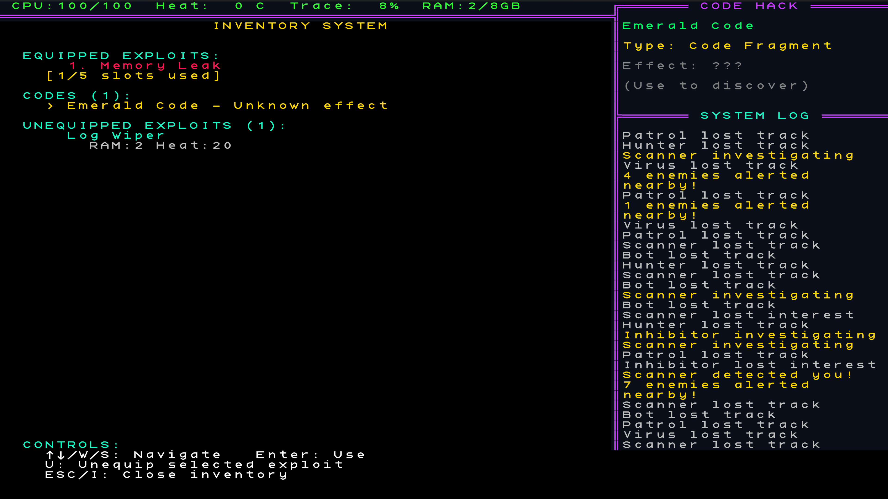

# Rogue Signal Protocol

**Version 1.0.0** - A coffee break cyberspace stealth roguelike built with Python and TCOD


---

## Documentation

**Choose your path:**

### Comprehensive Wiki (All Game Knowledge)
**[Visit the Wiki](https://github.com/Dragynrain/RogueSignalProtocol/wiki)** - Complete game encyclopedia including:
- Gameplay mechanics and systems
- All 47 achievements and how to unlock them
- Complete enemy, exploit, and item databases
- Status effects, code hacks, and progression guides
- UI/HUD explanations and settings reference
- Keybindings and inspection system guides

### For Players
**[README.txt](README.txt)** - Game instructions, controls, and gameplay guide

### For Developers, Modders & Contributors
**[README_DEV.md](docs/README_DEV.md)** - Complete developer guide including:
- Building from source
- Testing and development workflow
- Modding and JSON configuration
- Code architecture and TCOD gotchas
- Contributing guidelines
- Asset creation

---

## Quick Overview

A turn-based stealth roguelike. You play an escaped digital consciousness picking through hostile corporate networks. Runs take 10-15 minutes and end with permadeath.

### Key Features
- **No RNG in combat or movement** - only the layout is random
- **Enemy movement prediction** - each enemy shows its next 3 planned moves
- **3 procedurally-generated network levels** - 8 enemy types, 13 exploits
- **Dual rendering** - graphical sprites or ASCII/Unicode glyphs, toggle in-game

**Additional features:**
- **Stealth via blind spots** - break line of sight, attack from cover for +10 damage
- **Admin Avatar** - spawns when your trace gets too high, tracks perfectly, hard to kill
- **47 achievements** - persist across runs
- **20+ story fragments** - persist across runs, slowly assembling the Project Chimera plot
- **Audio** - music plus 40+ SFX, full keyboard/mouse/gamepad support

---

## Screenshots

<p align="center">
  
  
</p>
<p align="center">
  
  
  
</p>

---

## Community & Links

[](https://discord.gg/5fykUtECqz)
[](https://dragynrain.itch.io/rogue-signal-protocol)
[](https://github.com/Dragynrain/RogueSignalProtocol/)

- **Discord:** [https://discord.gg/5fykUtECqz](https://discord.gg/5fykUtECqz)
- **Itch.io:** [https://dragynrain.itch.io/rogue-signal-protocol](https://dragynrain.itch.io/rogue-signal-protocol)
- **GitHub:** [https://github.com/Dragynrain/RogueSignalProtocol/](https://github.com/Dragynrain/RogueSignalProtocol/)
- **Email:** roguesignalprotocol@gmail.com

Bug reports, balance complaints, fan art, mods - all welcome.

---

## Quick Start

### For Players (Pre-built Executable)
Download the latest release:
- **[Itch.io](https://dragynrain.itch.io/rogue-signal-protocol)** (recommended)
- **[GitHub Releases](https://github.com/Dragynrain/RogueSignalProtocol/releases)** (alternative)

#### Windows SmartScreen Warning
When running the executable for the first time, Windows may display a "Windows protected your PC" warning from **Windows Defender SmartScreen**. This is normal for unsigned executables.

**The game is safe to run.** This warning appears because:
- The executable is not digitally signed with a code signing certificate
- Code signing certificates cost hundreds of dollars annually
- As an indie game, it's not cost-effective to purchase one

**To run the game:**
1. Click **"More info"** on the SmartScreen warning
2. Click **"Run anyway"**

The warning may appear again if you download a new version or move the file to a different location.

#### Linux (Including Steam Deck)

Multiple distribution formats available from **[GitHub Releases](https://github.com/Dragynrain/RogueSignalProtocol/releases)**:

**AppImage (Recommended - works on any distro):**
```bash
chmod +x RogueSignalProtocol-*.AppImage
./RogueSignalProtocol-*.AppImage
```

**Tarball (manual installation):**
```bash
tar xzf RogueSignalProtocol-linux.tar.gz
cd RogueSignalProtocol
./RogueSignalProtocol
```

**Flatpak (via Flathub):**
```bash
flatpak install flathub info.aforster.roguesignalprotocol
```

**Arch Linux (AUR):**
```bash
yay -S rogue-signal-protocol-bin
```

**Steam Deck:** The game runs natively in Desktop Mode. Add as a non-Steam game for Gaming Mode. Resolution (1280x800) matches the Deck's screen perfectly. Full gamepad support included.

**Requirements:** SDL2 libraries (usually pre-installed on modern distros).

For detailed Linux packaging information, see [packaging/linux/README.md](packaging/linux/README.md).

### For Developers (From Source)

1. **Clone the repository**
   ```bash
   git clone https://github.com/Dragynrain/RogueSignalProtocol.git
   cd RogueSignalProtocol
   ```

2. **Set up virtual environment**
   ```bash
   python -m venv .venv
   # Windows:
   .venv\Scripts\activate
   # Linux/macOS:
   source .venv/bin/activate
   ```

3. **Install dependencies**
   ```bash
   pip install -r requirements.txt
   ```

4. **Run the game**
   ```bash
   python RogueSignalProtocol.py
   ```

See **[README_DEV.md](docs/README_DEV.md)** for complete development setup, testing, and building instructions.

---

## Contributing

We welcome contributions! See **[README_DEV.md](docs/README_DEV.md)** for:
- How to contribute
- Development workflow
- Testing requirements
- Code guidelines

---

## License

MIT License - Free and Open Source Software

This permissive license allows maximum freedom for both personal and commercial use. See [LICENSE](LICENSE) for details.

---

## Author

**Adam Forster** ([@Dragynrain](https://github.com/Dragynrain))

Contact: roguesignalprotocol@gmail.com

---

## Credits

- **Design & Programming:** Adam Forster
- **Engine:** Python + TCOD (libtcod)
- **Font:** KreativeSquare by Kreative Software
- **Graphics:** AI-generated sprites (Stable Diffusion, curated & edited)
- **Audio:** AI-generated music & SFX (AudioCraft, curated & edited)

Copyright (C) 2026 Adam Forster
